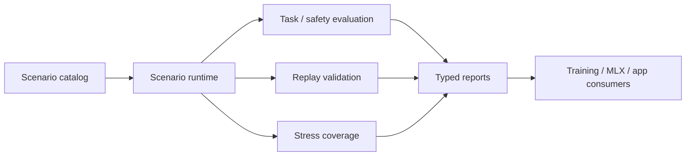
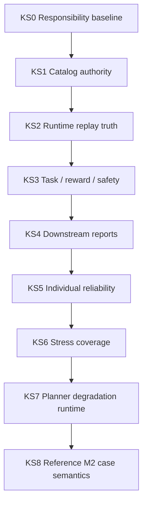

# Kuyu Scenarios Reliability Milestones

This document defines the local reliability ladder for `kuyu-scenarios`.
`../KUYU_CAPABILITY_ROADMAP.md` owns the cross-package capability order. This
file owns the package-local sequence that must be completed before downstream
training, backend, or app code treats scenario semantics as stable. Evidence is
recorded in `RELIABILITY_EVIDENCE.md`.

## End State

`kuyu-scenarios` is reliable when scenario truth can be resolved, executed,
evaluated, logged, replay-checked, stress-coverage checked, and consumed by
downstream packages without duplicating task, reward, safety, stress, or
pass/fail semantics.

## Advancement Rule

New work in `kuyu-scenarios` should advance the first incomplete milestone
unless there is a blocking defect in an earlier milestone. A milestone is
complete only when contract, implementation, fail-closed validation, regression
tests, and evidence all agree.

| Requirement | Completion meaning |
|---|---|
| Contract | Scenario-owned semantics are documented and represented by public types. |
| Runtime path | Production execution uses the scenario-owned catalog, runtime, and evaluators. |
| Fail-closed gate | Invalid, stale, missing, or ambiguous scenario evidence is rejected. |
| Regression tests | Positive and negative cases cover the scenario invariant. |
| Evidence | The verification command and scope are recorded. |

## Milestones

| ID | Name | Status | Purpose | Completion gate |
|---|---|---|---|---|
| KS0 | Responsibility baseline | Complete | Keep `kuyu-scenarios` scoped to scenario truth, reward, safety, runtime, logging, and replay semantics. | README boundary, package-local reliability docs, root static gate, and package-level xcodebuild test. |
| KS1 | Catalog and suite authority | Complete for current reference-quadrotor suites | Ensure task and suite resolution goes through public scenario-owned catalog APIs. | `ReferenceQuadrotorScenarioCatalog` tests for attitude, long-horizon attitude, lift, single-lift, and invalid requests. |
| KS2 | Runtime and replay truth | Complete for current baseline paths | Ensure runnable scenario execution records deterministic replay evidence instead of relying on caller trust. | Baseline replay runtime tests, deterministic replay tests, and explicit disabled-replay recording tests. |
| KS3 | Task, reward, and safety semantics | Complete for current public evaluators | Ensure pass/fail, reward descriptors, altitude-hold references, and safety costs are scenario-owned and validated. | Scenario terminal fact tests, task-quality tests, dense-reward/reference tests, and safety-cost descriptor tests. |
| KS4 | Downstream report readiness | Complete for current conformance/report paths | Ensure downstream packages consume typed reports that fail closed on missing replay or empty suites. | `A1ConformanceReportFactory` positive and negative tests plus root boundary gate linkage. |
| KS5 | Individual reliability baseline | Complete for current package-local baseline | Make `kuyu-scenarios` independently auditable before additional integration work depends on it. | `RELIABILITY_EVIDENCE.md`, root individual reliability map, static gate requirements, and package-level xcodebuild test. |
| KS6 | Stress coverage acceptance | Complete for current reference, reference M2 benchmark, articulated smoke paths, and saved-manifest artifact store | Ensure scenario stress coverage is accepted through public scenario-owned coverage targets, replay evidence, and a scenario-owned saved-artifact boundary. | `StressSuiteManifest` and `StressSuiteManifestArtifactStore` positive and negative tests for reference replay, reference M2 coverage, balanced reference M2 track counts, reference coverage-target derivation, articulated explicit skip, coverage gaps, replay gaps, decode-time artifact validation, tampered saved manifests, and write/read symlinked artifact-root escapes. |
| KS7 | Planner degradation runtime | Complete for current descending bridge contract | Ensure low-rate planner input reaches Kuyu as bounded descending bias with observable hold behavior under disconnect, fixed-rate updates, and invalid time. | `PlannerExecutorBridge` snapshot tests for disconnect hold, fixed-rate hold, non-monotonic time hold, clamp validation, and vector clamp/pad behavior. |
| KS8 | Reference M2 case semantics | Complete for current benchmark-case contract | Ensure M2 benchmark tracks cannot be accepted from labels alone when morphology-transfer or partial-observability evidence is missing. | `LongHorizonMorphologyTransferContract`, `LongHorizonBenchmarkSuite.validatedReferenceM2TrackCounts`, and manifest rejection tests for tag-only transfer and missing partial-observability evidence. |

## Dependency Order

## KS0: Responsibility Baseline

Status: complete.

Owned responsibility:

| Owned | Not owned |
|---|---|
| Scenario definitions, deterministic seeds, task-quality semantics, reward descriptors, safety envelopes, replay validation, scenario logs, and conformance reports | Training loop scheduling, PPO/BC/evolution algorithms, checkpoint selection, MLX model architecture, app rendering, or hardware-parity claims |

Acceptance evidence:

| Evidence | Required state |
|---|---|
| `README.md` | Documents responsibility boundary and reliability contract. |
| `RELIABILITY_MILESTONES.md` | Defines this package-local reliability ladder. |
| `RELIABILITY_EVIDENCE.md` | Records package-local verification commands and scope. |
| `../scripts/validate-unconscious-boundaries.sh` | Requires the scenario reliability files, links, tests, and source-safety gate. |
| Swift safety gate | Source validation rejects `try?`, `DispatchQueue`, `EventLoopFuture`, and `@unchecked Sendable` in package sources. |

## KS1: Catalog and Suite Authority

Status: complete for current reference-quadrotor suites.

Scenario selection must resolve through the package-owned catalog so downstream
training and MLX code cannot drift into separate suite identity maps.

Acceptance evidence:

| Invariant | Gate |
|---|---|
| A1 attitude suite resolution is package-owned. | `referenceQuadrotorScenarioCatalogResolvesA1AttitudeSuite`. |
| Long-horizon attitude suite resolution is package-owned. | `referenceQuadrotorScenarioCatalogResolvesLongHorizonAttitudeSuite`. |
| Lift and single-lift variations resolve through the same catalog. | `referenceQuadrotorScenarioCatalogResolvesLiftSuiteVariations` and `referenceQuadrotorScenarioCatalogResolvesSingleLiftSuiteVariations`. |
| Invalid catalog requests fail closed. | `referenceQuadrotorScenarioCatalogRejectsInvalidRequests`. |

## KS2: Runtime and Replay Truth

Status: complete for current baseline paths.

Runnable scenario output must carry replay evidence or explicitly record that
replay was disabled for the specific path. Baseline attitude, lift, and
single-lift replay execution is owned by `ReferenceQuadrotorBaselineReplayRuntime`.

Acceptance evidence:

| Invariant | Gate |
|---|---|
| Same-seed deterministic replay is bit-exact across stress runs. | `sameSeedReplayIsBitExactAcrossStress`. |
| Different seeds change trajectories. | `differentSeedChangesTrajectory`. |
| Baseline replay runtime performs lift and single-lift replay. | `baselineReplayRuntimePerformsLiftReplay` and `baselineReplayRuntimePerformsSingleLiftReplay`. |
| Baseline replay runtime rejects unsupported controllers. | `baselineReplayRuntimeRejectsNonBaselineController`. |
| Teacher runner records disabled replay explicitly when configured. | `kuyAtt1TeacherRunnerRecordsDisabledReplayExplicitly`. |

## KS3: Task, Reward, and Safety Semantics

Status: complete for current public evaluators.

Task success, terminal facts, altitude-hold references, reward descriptors, and
safety costs belong in this package. Downstream packages may consume them, but
must not reinterpret them.

Acceptance evidence:

| Invariant | Gate |
|---|---|
| Terminal fact combinations are validated before persistence. | `scenarioTerminalFactsValidateCompletedAndFailedStates` and `scenarioTerminalFactsRejectInvalidStateCombinations`. |
| Lift task quality accepts settled logs and rejects unsettled logs. | `taskQualityEvaluatorAcceptsSettledLiftLog` and `taskQualityEvaluatorRejectsUnsettledLiftLog`. |
| Attitude altitude references come from scenario authority. | `altitudeHoldReferenceUsesScenarioAuthority`. |
| Dense reward uses scenario altitude reference when no lift envelope exists. | `denseRewardPenalizesAttitudeAltitudeErrorWithoutLiftEnvelope`. |
| Safety cost is bounded, descriptor-backed, and input-validated. | `safetyCostIsZeroInsideMargin`, `safetyCostRisesLinearlyFromMarginToLimit`, `safetyCostCapsBeyondEnvelopeAndAddsViolationCost`, `safetyCostConfigRejectsInvalidValues`, and `safetyCostDescriptorTracksConfig`. |
| Reference-quadrotor RL reset/step semantics remain reviewable as the runtime grows. | `ReferenceQuadrotorRLEnvironment`, `ReferenceQuadrotorRLEnvironment+Reset`, `ReferenceQuadrotorRLEnvironment+Step`, `ReferenceQuadrotorRLEnvironment+Observation`, `ReferenceQuadrotorRLEnvironment+WorldModel`, simulator construction split files, and `referenceQuadrotorRLEnvironmentResponsibilitiesLiveInSplitFiles`. |

## KS4: Downstream Report Readiness

Status: complete for current conformance/report paths.

Reports published from `kuyu-scenarios` must be safe for downstream packages to
consume without recomputing acceptance.

Acceptance evidence:

| Invariant | Gate |
|---|---|
| Empty conformance suites fail closed. | `a1ConformanceReportFactoryRejectsEmptySuiteList`. |
| Reports require replay to have been performed. | `a1ConformanceReportFactoryRequiresPerformedReplay`. |
| Empty replay checks fail closed. | `a1ConformanceReportFactoryRejectsEmptyReplayChecks`. |
| Only passing suites with passing replay are accepted. | `a1ConformanceReportFactoryAcceptsOnlyPassingSuitesWithPassingReplay`. |

## KS5: Individual Reliability Baseline

Status: complete for current package-local baseline.

The package is independently auditable when this file, `RELIABILITY_EVIDENCE.md`,
README linkage, root individual reliability linkage, the source-safety static
gate, and package-level xcodebuild tests all pass.

Remaining maintenance rule: any new scenario truth boundary must add a positive
and negative regression test before downstream packages may depend on it. Any
new downstream consumer that treats scenario output as accepted must consume a
typed scenario-owned report, replay validator, or stricter package-local gate.

## KS6: Stress Coverage Acceptance

Status: complete for current reference, reference M2 benchmark, articulated
smoke paths, and saved-manifest artifact-store paths.

Stress-suite coverage must be accepted by scenario-owned types. Downstream
training, MLX, or app code may ask whether a suite covers the required stress
dimensions, but it must not locally reinterpret disturbance, degradation, drift,
swap, high-frequency stress, long-horizon, planner-degradation,
morphology-transfer, partial-observability, or articulated-dynamic semantics.

Acceptance evidence:

| Invariant | Gate |
|---|---|
| Reference-quadrotor stress suites require performed replay evidence matching every scenario key. | `stressSuiteManifestAcceptsReferenceCoverageWithReplay`, `stressSuiteManifestRejectsReferenceReplaySkip`, and `stressSuiteManifestRejectsMissingReplayCheck`. |
| Reference-quadrotor stress coverage targets can be derived from scenario-owned definitions. | `stressSuiteManifestDerivesReferenceCoverageTargets`. |
| Reference M2 benchmark coverage requires long-horizon, planner-degradation, morphology-transfer, disturbance, latency, and partial-observability dimensions. | `stressSuiteManifestAcceptsReferenceM2BenchmarkCoverage` and `stressSuiteManifestRejectsIncompleteReferenceM2BenchmarkCoverage`. |
| Reference M2 benchmark coverage requires positive, balanced long-horizon task, morphology-transfer, and disturbance/delay/partial-observability track counts. | `stressSuiteManifestRejectsImbalancedReferenceM2BenchmarkTracks` and `longHorizonBenchmarkSuiteRejectsInvalidScenariosPerTrack`. |
| Coverage gaps fail closed before downstream consumers can treat a suite as accepted. | `stressSuiteManifestRejectsUnmetCoverageTarget`. |
| Articulated dynamic suites may carry an explicit replay-skip reason while still recording stress dimensions. | `stressSuiteManifestAcceptsArticulatedExplicitReplaySkip`. |
| Persisted stress manifests cannot decode with tampered coverage counts. | `stressSuiteManifestDecodeRejectsCoverageCountTampering`. |
| Saved stress manifests reload only through the scenario-owned artifact store. | `stressSuiteManifestArtifactStoreRoundTripsValidatedManifest`, `stressSuiteManifestArtifactStoreRejectsTamperedManifest`, `stressSuiteManifestArtifactStoreRejectsSymlinkedManifestEscape`, and `stressSuiteManifestArtifactStoreRejectsSymlinkedManifestReadEscape`. |
| Stress manifest contracts remain reviewable as D1 coverage expands. | Static gates require the split schema, coding, factory, record mapping, coverage validation, replay validation, Reference M2 evidence schema, and Reference M2 manifest validation files, with line caps preventing `StressSuiteManifest.swift` and `StressSuiteManifest+ReferenceM2Evidence.swift` from absorbing those responsibilities again. |

## KS7: Planner Degradation Runtime

Status: complete for the current descending bridge contract.

Planner degradation scenarios must use typed descending-bias runtime contracts.
The planner bridge is not an actuator command path: it samples
`DescendingIntentProgram` at a fixed rate, clamps and pads values into the
declared channel count, and holds the last valid vector when planner input is
absent, disconnected, within the fixed-rate window, invalid, or
non-monotonic.

Acceptance evidence:

| Invariant | Gate |
|---|---|
| Planner disconnect holds the last valid descending vector and records snapshot status. | `plannerExecutorBridgeSnapshotsHoldWhenPlannerDisconnects`. |
| Fixed-rate sampling does not resample within the update period. | `plannerExecutorBridgeSnapshotsHoldWithinFixedRate`. |
| Non-monotonic planner time cannot replay stale past program values. | `plannerExecutorBridgeDoesNotReplayPastPlannerValuesOnNonMonotonicTime`. |
| Non-finite clamp ranges fail closed before bridge construction. | `plannerExecutorBridgeRejectsInvalidClampRanges`. |
| Program vectors are clamped and padded to the declared channel count. | `plannerExecutorBridgeSnapshotsClampAndPadProgramVectors`. |

## KS8: Reference M2 Case Semantics

Status: complete for the current benchmark-case contract.

Reference M2 benchmark acceptance must not be satisfied by track labels alone.
`LongHorizonBenchmarkSuite` validates case-level semantics before
`StressSuiteManifest.referenceQuadrotorM2Benchmark` can publish accepted
coverage. Morphology-transfer cases must carry a typed source/target descriptor
contrast, while disturbance/delay/partial-observability cases must carry
actual disturbance, latency, and sensor-observability degradation evidence.
The accepted manifest persists `ReferenceM2BenchmarkEvidence` so saved
downstream project-evidence packs do not collapse this contract back into
dimension counts alone. Planner degradation evidence is also persisted as
scenario IDs, not inferred only from balanced track counts.

Acceptance evidence:

| Invariant | Gate |
|---|---|
| Default M2 cases carry balanced counts, morphology transfer contracts, disturbance evidence, latency evidence, and partial-observability evidence. | `longHorizonBenchmarkSuiteDefaultCasesCarryReferenceM2Semantics`. |
| Accepted M2 stress manifests preserve case-level track, planner-degradation, and morphology evidence through JSON round-trip. | `stressSuiteManifestAcceptsReferenceM2BenchmarkCoverage`. |
| Planner-degradation saved evidence must point to records that actually carry the planner-degradation dimension. | `stressSuiteManifestRejectsReferenceM2PlannerDegradationEvidenceMismatch`. |
| A morphology-transfer case without a descriptor contrast fails before manifest acceptance. | `stressSuiteManifestRejectsReferenceM2MorphologyTransferWithoutContract`. |
| A disturbance/delay/partial-observability case without sensor-observability evidence fails before manifest acceptance. | `stressSuiteManifestRejectsReferenceM2PartialObservabilityWithoutEvidence`. |
| Tag-only transfer with identical source and target robot IDs is rejected by the contract itself. | `longHorizonMorphologyTransferContractRejectsTagOnlyTransfer`. |
